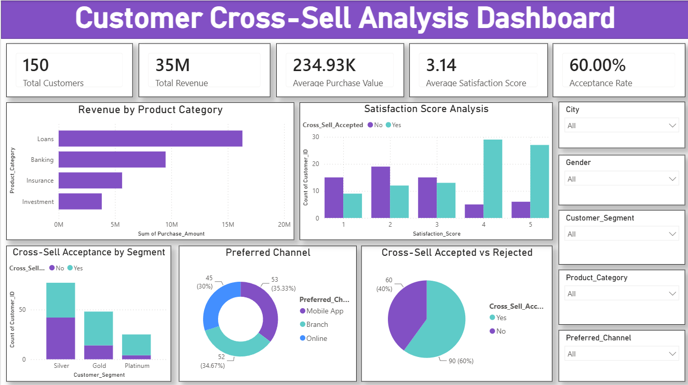

# 📊 Customer Cross-Sell Analytics

An end-to-end Data Analytics and Machine Learning project that predicts whether a customer is likely to accept a cross-selling offer. The project includes data preprocessing, exploratory data analysis (EDA), predictive modeling, and an interactive Power BI dashboard to uncover customer behavior, identify high-value customers, and support data-driven marketing strategies.

---

## 📌 Overview

Cross-selling is a powerful business strategy that increases revenue by offering additional products to existing customers. Predicting which customers are more likely to accept cross-selling offers enables businesses to improve conversion rates, personalize marketing campaigns, and enhance customer engagement.

This project focuses on:

* Data cleaning and preprocessing
* Exploratory Data Analysis (EDA)
* Feature engineering
* Cross-sell acceptance prediction using Machine Learning
* Interactive Power BI dashboard
* Business insights and recommendations

---

## 📂 Dataset

**Dataset:** Customer Cross-Sell Dataset

The dataset contains customer demographic information, purchase behavior, product ownership, satisfaction scores, and communication preferences used to predict cross-sell acceptance.

---

## 🛠️ Technologies Used

* Python
* Pandas
* NumPy
* Matplotlib
* Seaborn
* Scikit-learn
* Jupyter Notebook
* Power BI

---

## 📈 Project Workflow

```text
Data Collection
        │
        ▼
Data Cleaning & Preprocessing
        │
        ▼
Exploratory Data Analysis
        │
        ▼
Feature Engineering
        │
        ▼
Machine Learning Models
        │
        ▼
Model Evaluation
        │
        ▼
Power BI Dashboard
        │
        ▼
Business Insights
```

---

## 📊 Dashboard

### Dashboard Preview



### Dashboard Highlights

* 📌 Total Customers
* 📌 Total Revenue
* 📌 Average Purchase Value
* 📌 Average Satisfaction Score
* 📌 Cross-Sell Acceptance Rate

### Interactive Filters

* City
* Gender
* Customer Segment
* Product Category
* Preferred Channel

### Visualizations

* Revenue by Product Category
* Customer Segment vs Cross-Sell Acceptance
* Preferred Channel Analysis
* Satisfaction Score Analysis
* Accepted vs Rejected Customers
* Customer Distribution

---

## 📊 Exploratory Data Analysis

Key findings from the analysis include:

* Customers with **higher satisfaction scores** are more likely to accept cross-selling offers.
* **Platinum** and **Gold** customers have significantly higher acceptance rates than Silver customers.
* Customers with existing **Insurance** and **Personal Loan** products are more receptive to additional offers.
* **Mobile App** and **Branch** are the most effective communication channels for customer engagement.
* Customers with **higher purchase frequency** are more likely to accept cross-selling offers.
* Customers with **longer tenure** show slightly higher acceptance rates.
* **Purchase Amount** and **Average Order Value** have the strongest positive correlation among numerical features.

---

## 🤖 Machine Learning Models

The following classification models were implemented:

* Logistic Regression
* Random Forest Classifier

### Evaluation Metrics

* Accuracy
* Precision
* Recall
* F1-Score
* ROC-AUC Score
* Confusion Matrix

After comparing model performance, **Random Forest Classifier** was selected as the best-performing model.

---

## 💡 Business Recommendations

* Prioritize **Platinum** and **Gold** customers for cross-selling campaigns.
* Improve customer satisfaction to increase future acceptance rates.
* Personalize offers based on customers' purchase history and existing products.
* Focus marketing efforts on **Mobile App** and **Branch** channels.
* Target frequent purchasers with customized promotional offers.
* Use predictive analytics to identify customers with a high likelihood of accepting cross-selling offers.

---

## ⭐ Support

If you found this project helpful, consider giving it a ⭐ on GitHub!
